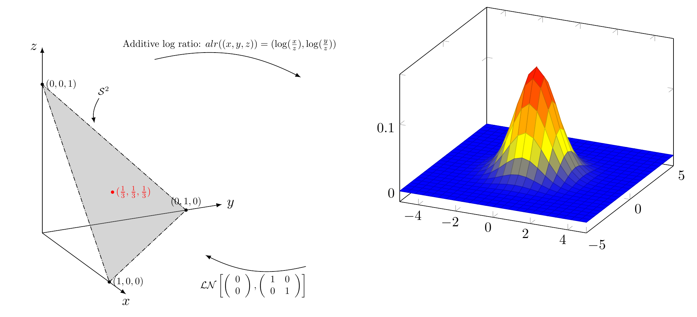

# Tikz picture

<!-- The use of engine.opts = list(template = "template.tex") is important in -->
<!-- making this tikz code compile -->

.center[
```{tikz, tikz-ex2, fig.cap = "Compositional Simplex", fig.ext = 'png', cache=TRUE, engine.opts = list(template = "template.tex"), echo = F, out.height = "50%", out.width = "30%"}

\tdplotsetmaincoords{70}{65}

\pgfsetarrowoptions{latex'-latex'new, arrowhead=1cm, line width=2pt}{8pt}
\begin{tikzpicture}[tdplot_main_coords, scale = 0.4]
 
\def\laxis{12}
\def\center{4/3}
\def\ltriangle{4}
\def\lt{6}

% Draw the axis
\begin{scope}[->,black]
\draw (0,0,0) -- (\laxis,0,0) node [below] {\textcolor{black}{$x$}};
\draw (0,0,0) -- (0,\laxis,0) node [right] {\textcolor{black}{$y$}};
\draw (0,0,0) -- (0,0,\laxis) node [left] {\textcolor{black}{$z$}};
\end{scope}

% draw ray through a point
\draw[solid,color = blue,->] (0,0,0) -- (0.7*8,0.7*12,0.7*8);
\filldraw [color = purple]    (2*3/2, 3*3/2, 2*3/2) circle (2pt) node [right, style = {scale = 0.8}] {$(2,3,2)$};
\filldraw [color = purple] (4, 6, 4) circle (2pt) node [right, style = {scale = 0.8}] {$(4,6,4)$};
\draw[solid,color = red,->] (0,0,0) -- (4,4,12);
\filldraw [color = black]  (2, 2, 6) circle (2pt) node [right, style = {scale = 0.8}] {$(1,1,3)$};
\filldraw [color = black] (3, 3, 9) circle (2pt) node [right, style = {scale = 0.8}] {$(3,3,9)$};

% draw the simplex
\filldraw [opacity=.33,gray] (\lt, 0, 0) -- (0, \lt, 0) -- (0, 0, \lt) -- cycle;
% draw the intersection of the ray and the simplex
\filldraw [blue] (\lt*2/7, \lt*3/7, \lt*2/7) circle (1pt) node [right, style={scale=0.5}] {$(\tfrac{2}{7},\tfrac{3}{7},\tfrac{2}{7})$};
\filldraw [red] (\lt*1/5, \lt*1/5, \lt*3/5) circle (1pt) node [right, style={scale=0.5}] {$(\tfrac{1}{5},\tfrac{1}{5},\tfrac{3}{5})$};

% draw the projection on the x-y plane
\draw[dashed,color = orange,->] (\lt*2/7, \lt*3/7, \lt*2/7) -- (\lt*2/7, \lt*3/7, 0);
\filldraw [blue] (\lt*2/7, \lt*3/7, 0) circle (1pt) node [below, style={scale=0.5}] {$(\tfrac{2}{7},\tfrac{3}{7},0)$};

% draw the closure to the face
\draw[dashed,color = orange,-] (0,0,0) -- (\lt*2/7, \lt*3/7, 0);
\draw[dashed,color = orange,->]  (\lt*2/7, \lt*3/7, 0) -- (\lt*2/5,\lt*3/5,0);
\filldraw [blue] (\lt*2/5, \lt*3/5, 0) circle (1pt) node [right, style={scale=0.5}] {$(\tfrac{2}{5},\tfrac{3}{5},0)$};

% identify the vertex
\filldraw [green] (0,0,\lt) circle (1pt) node [right, style={scale=0.5}] {$(0,0,1)$};

% draw the projection from the vertex
\draw[densely dashdotted,color = magenta,->] (0,0,\lt) -- (\lt*2/5,\lt*3/5,0);

\end{tikzpicture}

```
]

---

# Logistic Normal

.center[

```{r logisticN, echo = FALSE, eval = TRUE, message=FALSE, warning=FALSE,fig.pos = "H", fig.path='fig/plot-', dev='png', fig.ext='png', out.width= "90%",out.height="90%", fig.cap = "Logistic Normal."}



```

]

---

# Thanks

Thanks!
To you all for listening.


